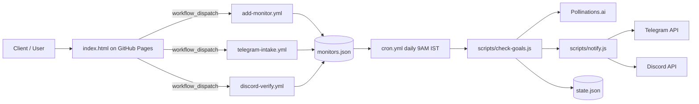

# GoalWatch Architecture

## Read the diagram

- The frontend is static and can be hosted on GitHub Pages.
- GitHub Actions handle all updates to monitor data and notifications.
- `monitors.json` is the source of truth for active monitors.
- `state.json` stores the last evaluation result so the same "goal met" event is not spammed.
- Pollinations.ai is used only for reasoning, not as a hosted backend.

## Trust boundary

- Browser input is public and temporary.
- GitHub Actions are the execution layer.
- Secrets stay inside GitHub Secrets.
- GitHub PAT is only a temporary MVP dispatch method.
